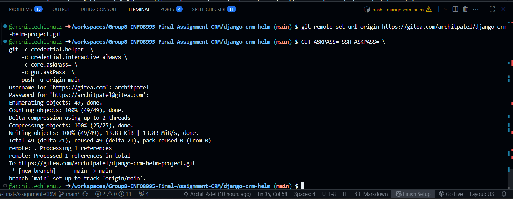
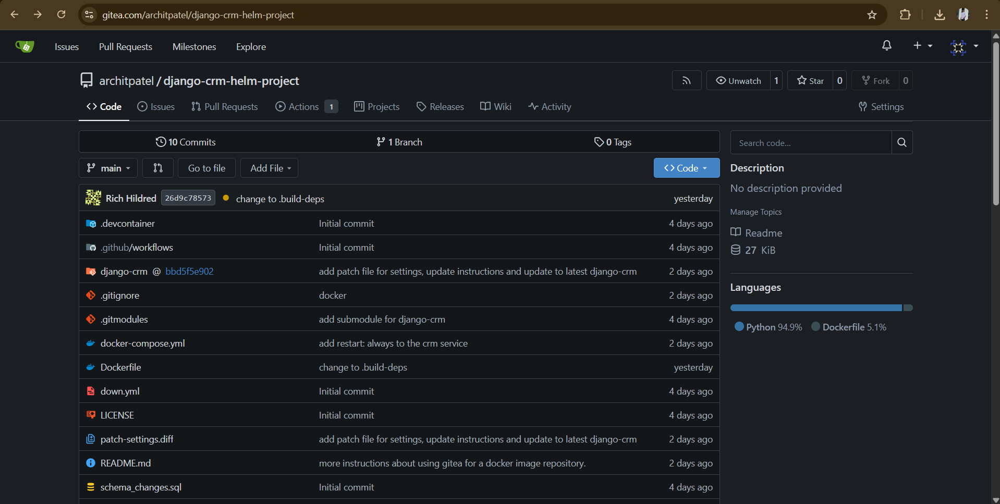
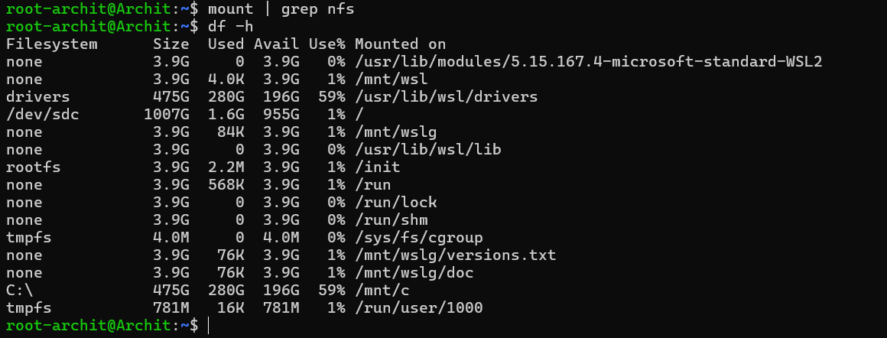

# Django CRM Helm Project

## 📌 Project Overview

This project deploys a **Django-based CRM** application using **Helm charts** on a Kubernetes cluster.
It uses MySQL as the database and Traefik as the ingress controller. The setup is designed for local Kubernetes development environments like **k3s**, **minikube**, or **WSL2-based clusters**.

---

## 🚀 Features

* Django CRM web application
* MySQL backend database
* Kubernetes manifests managed with Helm
* Traefik ingress configuration
* NodePort and Ingress access methods
* Ready-to-use Docker images
* CI/CD pipeline for build & push

---

## 🛠 Tech Stack

* **Backend**: Django
* **Database**: MySQL
* **Containerization**: Docker
* **Orchestration**: Kubernetes (Helm)
* **Ingress**: Traefik
* **CI/CD**: GitHub Actions / Gitea

---

## 📂 Repository Structure

```
.
├── django-crm/               # Django CRM application source code
├── django-crm-helm/          # Helm chart for deployment
├── Screenshots/              # Project screenshots
├── docker-compose.yml        # Local Docker setup
├── Dockerfile                # Application Docker build file
├── up.yml                    # Kubernetes deployment script
├── down.yml                  # Kubernetes teardown script
├── patch-settings.diff       # Django settings patch
├── schema_changes.sql        # SQL schema updates
└── README.md                 # Project documentation
```

---

## ⚙️ Setup Instructions

### 1️⃣ Prerequisites

Make sure you have installed:

* Python 3.10+
* Docker & Docker Compose
* Kubernetes (k3s / minikube / other)
* Helm 3+
* kubectl CLI
* Git

---

### 2️⃣ Clone the Repository

```bash
git clone https://github.com/<your-username>/django-crm-helm-project.git
cd django-crm-helm-project
```

---

### 3️⃣ Local Development (Docker Compose)

```bash
docker-compose up --build
```

Application will be available at:
`http://localhost:8000`

---

### 4️⃣ Kubernetes Deployment (Helm)

```bash
helm install crm-chart ./django-crm-helm -n crm --create-namespace
```

Check pods:

```bash
kubectl -n crm get pods
```

---

### 5️⃣ Expose Service via NodePort

```bash
kubectl -n crm apply -f nodeport-service.yml
```

Access via:
`http://<NODE-IP>:30080`

---

### 6️⃣ Access via Traefik Ingress

If Traefik is installed:

```bash
kubectl -n crm apply -f ingress.yml
```

Access via:
`http://crm.local`

---

## 🖼 Screenshots

### Home Page



### Admin Panel



### Database View



---

## 🔄 CI/CD Pipeline

The project includes a GitHub Actions / Gitea workflow for:

* Building Docker images
* Pushing images to container registry
* Deploying to Kubernetes via Helm

---

## 📜 License

This project is licensed under the **MIT License**.
